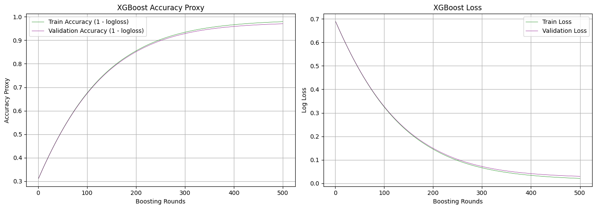
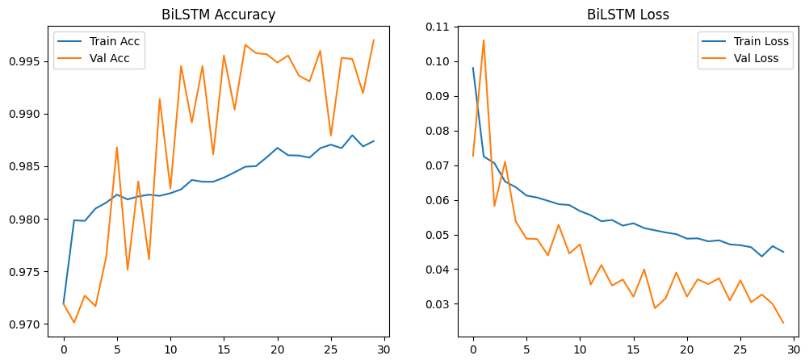

# Hybrid Deep Learning Pipeline for Heart Disease Prediction


## 🩺 Project Overview

This project implements a **hybrid deep learning framework** for early and accurate heart disease prediction using:
- **Bi-LSTM** for temporal ECG signal analysis
- **XGBoost** for structured clinical data
- **SMOTE** for handling class imbalance
- **Kalman Filtering** for noise reduction
- **Hyperopt** for hyperparameter tuning
- **Ensemble Learning** via probability averaging

📊 Achieved **99.76% Accuracy** and **99.71% F1-Score** on the UCI Heart Disease Dataset.

---

## 🚀 Features

- 📈 **High Accuracy:** Robust against noise and class imbalance
- ⚙️ **Optimized Pipeline:** End-to-end preprocessing to prediction
- 🧠 **Hybrid Modeling:** Combines ML (XGBoost) and DL (Bi-LSTM)
- 🌐 **Scalable Design:** Real-time readiness for IoT & cloud deployment

---

## 🧰 Tech Stack

- Python 3.x
- TensorFlow / Keras
- XGBoost
- Scikit-learn
- Hyperopt
- Pandas, NumPy, Matplotlib

---

## 📁 Dataset

- UCI Heart Disease Dataset  
  [Link](https://archive.ics.uci.edu/dataset/45/heart+disease)

Dataset includes:
- Structured clinical records
- ECG time-series data (after preprocessing)
- Multiple `.data` files with delimiter inconsistencies (handled automatically)

---

## 🔧 Setup Instructions

```bash
# Clone the repo
git clone https://github.com/your-username/heart-disease-prediction.git
cd heart-disease-prediction
```

# Create a virtual environment
python -m venv venv
source venv/bin/activate  # or venv\Scripts\activate (Windows)

# Install dependencies
pip install -r requirements.txt

# Run the Jupyter Notebook
jupyter notebook


## 📊 Results

### 🔹 XGBoost Performance

- Achieved stable improvement in both training and validation accuracy.
- Log loss steadily decreased indicating good convergence and minimal overfitting.



---

### 🔹 Bi-LSTM Performance

- High accuracy with very low loss, despite some fluctuation in validation accuracy.
- Indicates excellent temporal pattern learning and generalization.



---

### 🏆 Performance Summary

| Model                | Accuracy (%) | F1-Score (%) |
|---------------------|--------------|--------------|
| Baseline (XGBoost + Bi-LSTM) | 97.68        | 97.10        |
| **Hybrid Model**     | **99.76**    | **99.71**    |
| ViT-Enhanced Model   | 98.07        | 97.71        |

